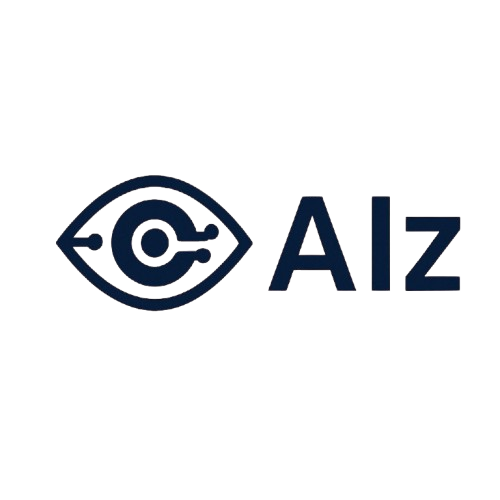

<p align="center">
  
</p>


# MyAIs

**AIz** is an innovative application that leverages cutting-edge **Vision-Language Models (VLMs)** and **Gemini's multimodal capabilities** to assist visually impaired individuals. By providing real-time audio alerts about potential hazards and recognizing familiar faces, AIz enhances users’ safety, awareness, and independence.

## Features

- 🔊 **Real-Time Audio Alerts**  
  Detects potential hazards in the environment and provides immediate voice feedback to help users navigate safely.

- 🌐 **Gemini-Based Vision-Language Understanding**  
  Harnesses the power of Google's **Gemini** to analyze visual scenes and generate rich, context-aware descriptions and hazard alerts.

- 🧍‍♂️ **Friend Recognition**  
  - Users can submit facial data of trusted individuals.  
  - The mobile device scans the environment using its camera.  
  - The application notifies the user when a familiar face is detected nearby.  
  - Facial recognition is powered by the open-source library [DeepFace](https://github.com/serengil/deepface).

## How It Works

1. **Data Input**: The user initiates a scan of their surroundings via a mobile device.
2. **Scene Understanding**: Gemini processes the visual data and interprets the environment.
3. **Hazard Detection**: Potential risks are identified and described contextually.
4. **Audio Feedback**: Descriptions and alerts are delivered through text-to-speech in real-time.
5. **Facial Recognition**: Registered faces are matched using DeepFace to identify known individuals.

## Installation

```bash
git clone https://github.com/yourusername/MyAIs.git
cd MyAIs
# Follow additional setup instructions here (e.g., environment setup, model download, etc.)

## Requirements

- Python 3.x  
- [DeepFace](https://github.com/serengil/deepface)  
- Gemini API Access or integration  
- PyTorch / TensorFlow (depending on DeepFace and Gemini backend requirements)  
- Mobile development framework (e.g., Flutter, React Native) for deployment  

## Getting Started

1. Clone this repository:
   ```bash
   git clone https://github.com/yourusername/MyAIs.git
   cd MyAIs

2. Set up the required dependencies.

3. Obtain access to the Gemini API for Vision-Language Model (VLM) capabilities.

4. Launch the application in a mobile development environment or connect it to a real device.

5. Upload facial data via the app interface.

6. Start scanning your environment!

## Future Work

- Enhanced support for different lighting and weather conditions

- Expanded recognition for more complex scenes

- Integration with wearable devices

- Support for multilingual audio feedback

